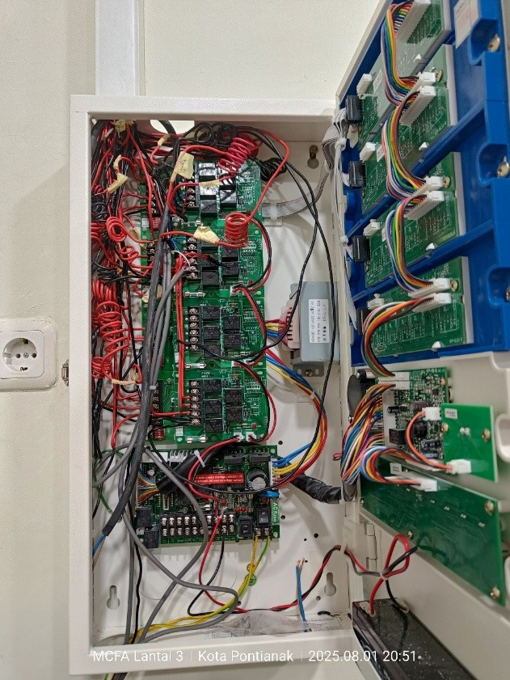
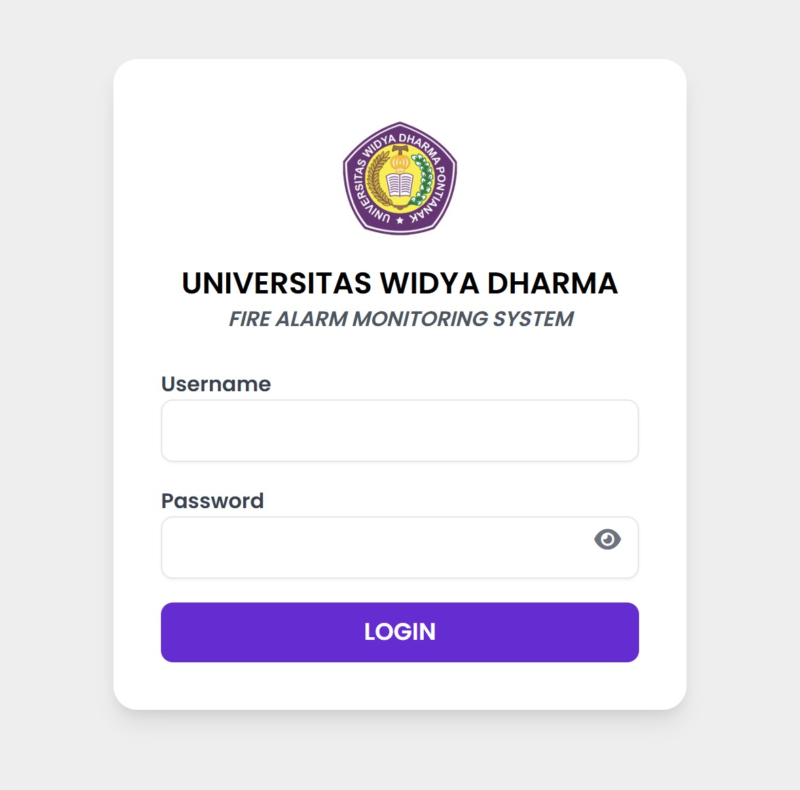
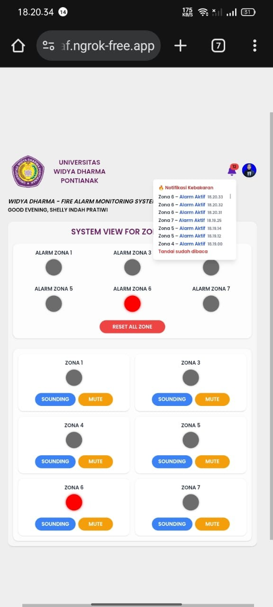
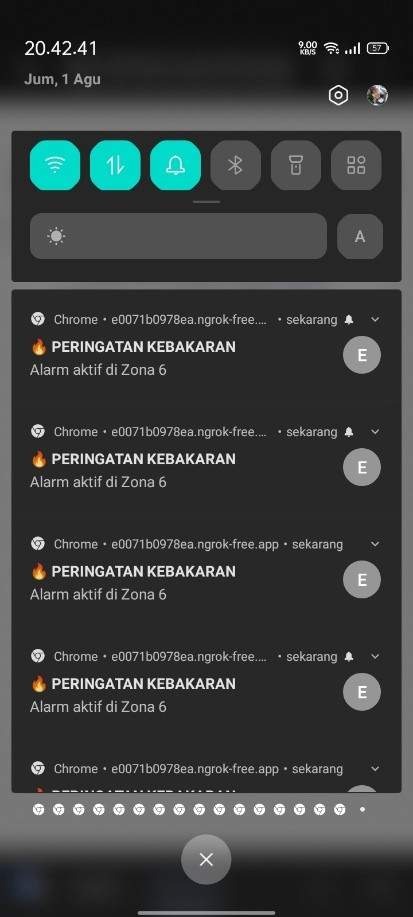
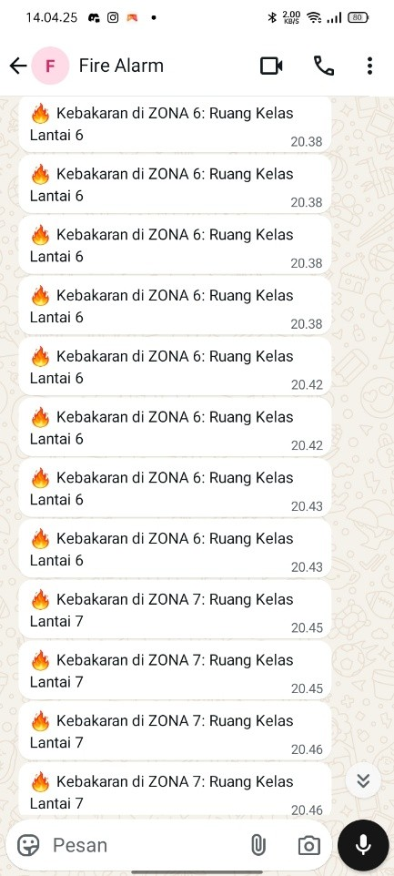

# 🔥 Sistem Deteksi Kebakaran Berbasis PLC dengan Pemantauan Web

Proyek ini merupakan **sistem deteksi kebakaran** berbasis **PLC Outseal Mega V3** yang terintegrasi dengan **MCFA (Main Control Fire Alarm)**, serta dapat dipantau secara **real-time melalui antarmuka web** menggunakan komunikasi **Modbus RTU/TCP**.  
Sistem ini mampu mendeteksi **asap** maupun **panas** menggunakan sensor Hooseki, dan memberikan peringatan dini berupa **alarm fisik** serta **notifikasi ke smartphone**.

---

## ⚡ Fitur Utama
- **Deteksi panas** menggunakan Heat Detector Hooseki HS-02.  
- **Deteksi asap** menggunakan Smoke Detector Hooseki HS-WT30L.  
- **MCFA Panel 20 Zone** sebagai pusat kendali alarm.  
- **PLC Outseal Mega V3** menerima data kondisi zona dari MCFA, kemudian mengintegrasikannya ke dalam sistem web.  
- **Pemantauan dan notifikasi berbasis web** melalui komunikasi Modbus TCP.  
- **Alarm bell** dan **relay eksternal** sebagai perangkat peringatan darurat.  
- **Push button reset** untuk mengembalikan sistem secara manual.  

---

## 🔧 Alat dan Bahan
- PLC Outseal Mega V3  
- Modul USR-TCP232-306 (Serial to Ethernet)  
- Router TP-Link TL-WR842N  
- Relay 24VDC  
- Switching Power Supply 24V 10A  
- Detektor Panas HS-02 Hooseki  
- Detektor Asap HS-WT30L Hooseki  
- MCFA Panel Hooseki HS-20L (20 Zone)  
- Alarm Bell Hooseki HS-FB6  
- Push Button 24VDC  

---

## 📊 Perancangan dan Desain
- Perancangan sistem deteksi kebakaran
          
  
  
    

  
           
  

- Desain antarmuka pemantauan web
        
  

  

- Desain notifikasi
  
  

  

---

## 🚀 Cara Kerja
1. **Sensor panas atau asap aktif** → mengirimkan sinyal ke **MCFA panel**.  
2. **MCFA memproses sinyal** → jika melebihi ambang batas, panel masuk ke tahap kedua dan memicu alarm.  
3. **MCFA mengirimkan status zona** ke **PLC Outseal Mega V3**.  
4. **PLC** meneruskan data melalui **Modbus TCP** ke server/web.  
5. **Antarmuka web menampilkan status zona** secara real-time sekaligus mengirimkan **notifikasi ke smartphone**.  
6. **Alarm bell berbunyi**, dan dapat dikontrol (Sounding, Mute, Reset) melalui web.  

---

